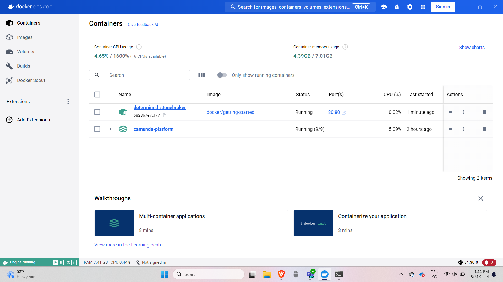
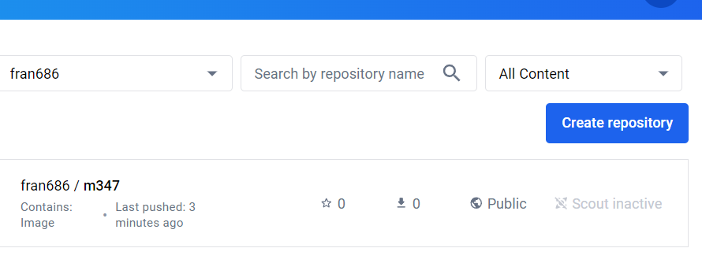
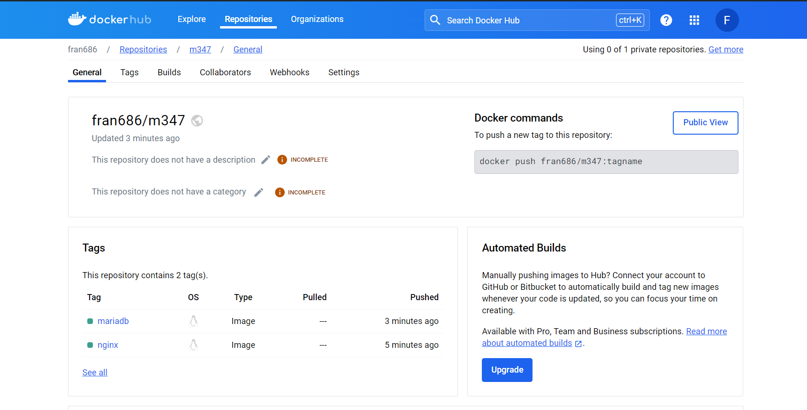

# KN01-Docker Grundlagen

### A. Installation (20%)

1. Screenshot der Webseite, nachdem Sie den ersten Container erstellt haben.
     

2. Screenshot der Containers in Docker Desktop, der Ihren Container zeigt.
     

### B. Docker Command Line Interface (CLI) (50%)

1.  Alle Befehle auflistet, die Sie eben verwendet haben.  
2.  Erklärungen zu den Befehlen, falls erwartet.  
3.  Screenshots gem. den Bemerkungen in der Ausführungsliste.

        - `docker version`
           Um die Docker-Version zu überprüfen.  
        - `docker search --filter=is-official=true ubuntu` oder

    `docker search --filter=is-official=true nginx` Um das offizielle Ubuntu- / Nginx-Docker-Image auf Docker Hub zu erhalten.  - `docker pull nginx` - `docker create --name my_nginx -p 8081:80 nginx` - `docker start my_nginx` - _docker run_ = _docker pull_, _docker create_ und _docker start_ (nacheinander ausgeführt)
       - `docker run -d -p 80:80 docker/getting-started`   - _docker run_ Mit diesem Befehl wird ein Docker-Container gestartet. - _-d_ Diese Flagge steht für den "detached" Modus. Es bedeutet, dass der Container im Hintergrund läuft und man die Kontrolle über sein Terminal zurückerhält. - _-p 80:80_ Dieser Parameter mappt Port 80 auf dem Hostrechner auf Port 80 innerhalb des Containers. - _docker/getting-started_ Der Name des Docker-Images, aus dem der Container gestartet wird. - `docker run -d --name my_ubuntu ubuntu` Da das Ubuntu-Image nicht lokal heruntergeladen wird, versucht Docker automatisch, das Ubuntu-Image aus der Docker Hub Registry zu ziehen.
    Nach dem Herunterladen des Images versuchte Docker, den Container zu starten, was jedoch sofort beendet wurde, da keine Prozesse im Container laufen. - `docker run -it ubuntu` Docker startet den Container und verbindet ein interaktives Terminal mit ihm.
    Da die -it-Flags verwendet werden, läuft der Container so lange im Vordergrund, bis Sie die interaktive Sitzung beendet wird.
    (nicht jedes Image im Hintergrund ausgeführt werden kann) - `docker exec -it my_nginx /bin/bash` Eine interaktive Shell eines laufenden Containers, nämlich my_nginx, wird geöffnet.
       - `service nginx status` - `docker stop my_nginx` Mit diesem Befehl wird der Container mit dem Namen my_nginx beendet. - `docker ps -a --filter "name=my_nginx"` Der Status des Containers "my_nginx" wird überprüft.
       - `docker rm $(docker ps -aq)` Entfernt alle Container in Docker - `docker rmi nginx` Dieser Befehl entfernt das Nginx-Image.

### C. Registry und Repository (10%)

1. Screenshot mit dem leeren Inhalt des neu erstellten Repository
     

### D. Privates Repository (20%)

1. Screenshot der Docker-Hub Seite mit den sichtbaren Tags Ihres Repos:
     

2. Befehle, die Sie ausgeführt haben und erklärung zu den Befehlen, die die einzelnen Komponenten beschreiben.
   1. `docker pull nginx`
   2. `docker tag nginx:latest fran686/m347:nginx`
   3. `docker pull mariadb`
   4. `docker tag mariadb:latest fran686/m347:mariadb`
   5. `docker push fran686/m347:nginx`
   6. `docker push fran686/m347:mariadb`

`docker tag nginx:latest username/reponame:nginx`: Dieser Befehl nimmt das Docker-Image genannt nginx mit dem Tag latest (was die neueste Version des Images angibt) und erstellt ein neues Tag für dieses Image. Das neue Tag lautet username/reponame:nginx.
Tags werden verwendet, um verschiedene Versionen desselben Images zu kennzeichnen, z. B. latest, v1.0, development usw. So können Benutzer und Systeme bestimmte Versionen eines Images identifizieren und verwenden.

Mit dem Befehl `docker push` wird ein lokales Docker-Image in ein Docker-Repository hochgeladen.
